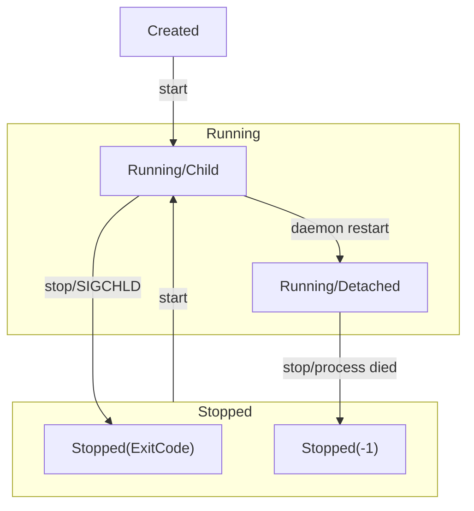

# PM (process manager)

## Installation
PM is available only for linux due to heavy usage of linux mechanisms. For now only installation way is to use `go install`:
```sh
go install github.com/rprtr258/pm@latest
```

Then start/restart `pm` daemon:
```sh
pm daemon restart
```

## Configuration
See [example configuration file](./config.jsonnet).

## Usage
Most fresh usage descriptions can be seen using `pm <command> --help`.

### Run process
```sh
# run process using command
pm run go run main.go

# run processes from config file
pm run --config config.jsonnet
```

### List processes
```sh
pm list
```

### Start processes that already has been added
```sh
pm start <id or name or tag...>
```

### Stop processes
```sh
pm stop <id or name or tag...>

# e.g. stop all addedprocesses (all processes has tag `all` by default)
pm stop all
```

### Delete processes
When deleting process, they are first stopped, then removed from `pm`.
```sh
pm delete <id or name or tag...>

# e.g. delete all processes
pm delete all
```


## Process state diagram

