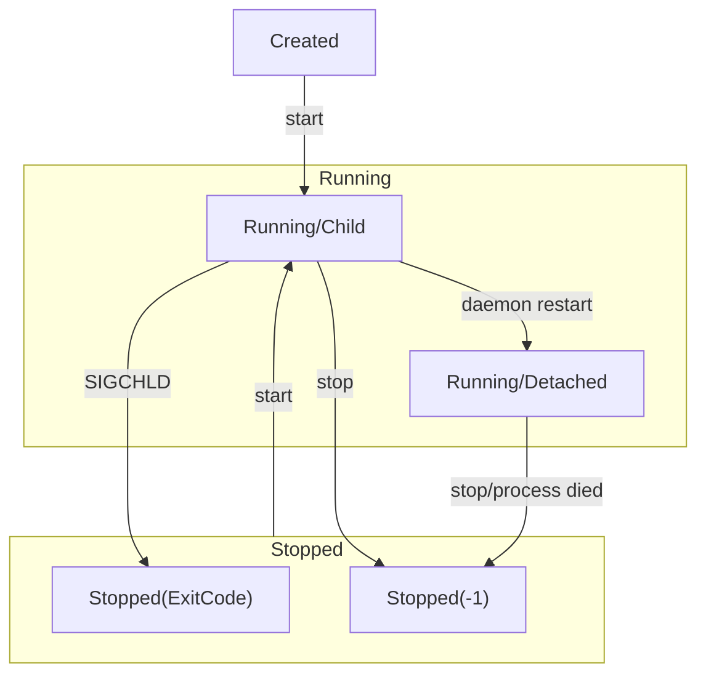

# PM (process manager)

## Installation
PM is available only for linux due to heavy usage of linux mechanisms. For now only installation way is to use `go install`:
```sh
go install github.com/rprtr258/pm@latest
```

### Systemd service
To enable running processes on system startup:
- Copy [`pm.service`](./pm.service) file locally. This is the systemd service file that tells systemd how to manage your application.
- Change `User` field to your own username. This specifies under which user account the service will run, which affects permissions and environment.
- Change `ExecStart` to use `pm` binary installed. This is the command that systemd will execute to start your service.
- Move the file to `/etc/systemd/system/pm.service` and set root permissions on it:
```sh
# copy service file to system's directory for systemd services
sudo cp pm.service /etc/systemd/system/pm.service
# set permission of service file to be readable and writable by owner, and readable by others
sudo chmod 644 /etc/systemd/system/pm.service
# change owner and group of service file to root, ensuring that it is managed by system administrator
sudo chown root:root /etc/systemd/system/pm.service
# reload systemd manager configuration, scanning for new or changed units
sudo systemctl daemon-reload
# enables service to start at boot time
sudo systemctl enable pm
# starts service immediately
sudo systemctl start pm
```

After these commands, processes with `startup: true` config option will be started on system startup.

## Configuration
[jsonnet](https://jsonnet.org/) configuration language is used. It is also fully compatible with plain JSON, so you can write JSON instead.

See [example configuration file](./config.jsonnet). Other examples can be found in [tests](./tests) directory.

## Usage
Most fresh usage descriptions can be seen using `pm <command> --help`.

### Run process
```sh
# run process using command
pm run go run main.go

# run processes from config file
pm run --config config.jsonnet
```

### List processes
```sh
pm list
```

### Start processes that already has been added
```sh
pm start [ID/NAME/TAG]...
```

### Stop processes
```sh
pm stop [ID/NAME/TAG]...

# e.g. stop all added processes (all processes has tag `all` by default)
pm stop all
```

### Delete processes
When deleting process, they are first stopped, then removed from `pm`.
```sh
pm delete [ID/NAME/TAG]...

# e.g. delete all processes
pm delete all
```


## Process state diagram


## Development

### Architecture
`pm` consists of two parts:
- cli client - requests server, launches/stops shim processes
- shim - monitors and restarts processes, handle watches, signals and shutdowns

### PM directory structure
`pm` uses directory `$HOME/.pm` to store data. Layout is following:

```sh
$HOME/.pm/
├──config.json # pm config file
├──db/ # database tables
│   └──procs.json # processes table
└──logs/ # processes logs
    ├──<ID>.stdout # stdout of process with id ID
    └──<ID>.stderr # stderr of process with id ID
```

### Differences from [pm2](https://github.com/Unitech/pm2)
- `pm` is just a single binary, not dependent on `nodejs` and bunch of `js` scripts
- [jsonnet](https://jsonnet.org/) configuration language, back compatible with `JSON`, and allows to thoroughly configure processes, e.g. separate environments without requiring corresponding mechanism in `pm` (others configuration languages might be added in future such as `Procfile`, `HCL`, etc.)
- supports only `linux` now
- I can fix problems/add features as I need, independent of whether they work or not in `pm2`, because I don't know `js`
- fast and convenient (I hope so)
