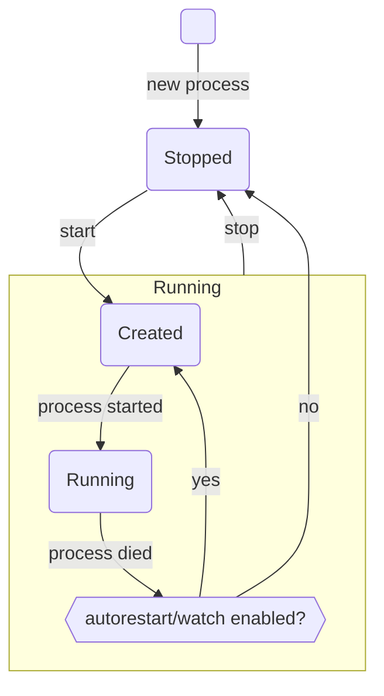

# PM (process manager)
<p align="center"></p>

PM is a process manager for Linux: declare your long-running processes in a config file, and PM starts them, keeps them running in the background, restarts them when they crash or when the code changes, and shows you status, logs, and a TUI dashboard. It's like [pm2](https://pm2.keymetrics.io/) — but a single static binary with no Node.js and no JS scripts, and declarative configs in six formats.

- **Single binary.** One static Linux binary — no Node.js, no JS scripts. Also installable with `go install github.com/rprtr258/pm@latest`.
- **Six config formats.** [Jsonnet](https://jsonnet.org/) (primary, back-compatible with JSON), YAML, TOML, INI, HCL, JSON — pick one per project.
- **Configs are code.** Jsonnet configs can use loops to create lists of similar processes, imports, `dotenv`, and external variables.
- **Self-healing.** Auto-restart with a retry budget (`--max-restarts`), restart on file changes (`watch`), periodic restarts on a cron schedule (`cron`).
- **Groups and ordering.** Every command accepts ids, names, or tags — `pm stop all`. `depends_on` starts processes in dependency order.
- **Survives reboots.** Processes with `startup: true` run on boot via an installed systemd service.
- **Linux only.** PM is available only for Linux due to heavy usage of Linux mechanisms.

## Example

```yaml
# pm.yaml
web:
  command: "python3"
  args: ["-m", "http.server", "8345"]
  tags: ["demo"]
```

```console
$ pm run -f pm.yaml
web

$ pm list
╭────┬──────┬─────────┬────────┬──────────┬───────┬──────────╮
│ id │ name │ status  │ uptime │   tags   │  cpu  │  memory  │
├────┼──────┼─────────┼────────┼──────────┼───────┼──────────┤
│ 9  │ web  │ running │ 7s     │ demo all │ 0.54% │ 22.14 MB │
╰────┴──────┴─────────┴────────┴──────────┴───────┴──────────╯

$ pm logs demo
web  | Serving HTTP on 0.0.0.0 port 8345 (http://0.0.0.0:8345/) ...
```

## Contents

- [Installation](#installation)
- [Getting started](#getting-started)
- [Configuration](#configuration)
- [Usage](#usage)
- [Process state diagram](#process-state-diagram)
- [Development](#development)

## Installation
Download the latest binary from the [releases](https://github.com/rprtr258/pm/releases/latest) page:

```sh
# download binary
wget https://github.com/rprtr258/pm/releases/latest/download/pm_linux_amd64
# make binary executable
chmod +x pm_linux_amd64
# move it to a directory in your $PATH, renaming it to pm
sudo mv pm_linux_amd64 /usr/local/bin/pm
```

Or install from source with Go:

```sh
go install github.com/rprtr258/pm@latest
```

## Getting started

1. Write a config file — say `pm.yaml` — listing your processes:

    ```yaml
    web:
      command: "node"
      args: ["server.js"]
      tags: ["web"]
      startup: true

    worker:
      command: "python3"
      args: ["-u", "worker.py"]
      watch: "\\.py$"
    ```

2. Start everything in the config:

    ```sh
    pm run -f pm.yaml
    ```

    Processes keep running in the background; you can close the terminal.

3. Watch what's going on:

    ```sh
    pm list            # status, uptime, cpu, memory
    pm logs all        # follow logs of every process
    ```

4. Control processes — by id, name, or tag:

    ```sh
    pm stop web
    pm restart worker
    pm delete all      # stop and remove everything
    ```

5. To run processes on system startup, install the systemd service once (the unit hardcodes `ExecStart=/usr/bin/pm`, and `--username` makes the service run processes as your user instead of root):

    ```sh
    # make the binary reachable as /usr/bin/pm
    sudo ln -s "$(command -v pm)" /usr/bin/pm
    # install systemd service
    sudo pm startup systemd --username <your-username>
    # run all processes with startup right now
    pm startup
    ```

## Configuration
PM supports multiple configuration formats for defining processes. The original [jsonnet](https://jsonnet.org/) format is supported, along with several additional formats for flexibility:

- [JSONNet](https://jsonnet.org/) (`.jsonnet`) — the primary configuration format, fully compatible with plain JSON.
- [YAML](https://yaml.org/) (`.yaml`, `.yml`) — human-readable data serialization standard.
- [TOML](https://toml.io/) (`.toml`) — Tom's Obvious, Minimal Language configuration format.
- [INI](https://en.wikipedia.org/wiki/INI_file) (`.ini`, `.cfg`, `.conf`) — classic section-based configuration format.
- [HCL](https://github.com/hashicorp/hcl) (`.hcl`) — HashiCorp configuration language.
- [JSON](https://www.json.org/) (`.json`) — plain data-interchange format.

All formats define a list of processes with the same schema:

| Field | Type | Description |
|-------|------|-------------|
| `command` | `string` | Command to execute (required) |
| `name` | `string` | Process name; the section key in YAML/TOML/INI/HCL, a field in JSON/JSONNet. Auto-generated if omitted |
| `args` | `array(string)` | Command arguments |
| `cwd` | `string` | Working directory |
| `env` | `map(string, string)` | Environment variables (name: value pairs) |
| `tags` | `array(string)` | Process tags for filtering; every process gets the `all` tag automatically |
| `watch` | `string` | File pattern to watch for restarts (regex) |
| `startup` | `boolean` | Start process on system startup |
| `depends_on` | `array(string)` | Process names that must start first |
| `cron` | `string` | Cron expression for periodic restarts |

Auto-restart budget is set per invocation with `pm run --max-restarts COUNT`; see `pm run --help` for all flags.

Example in [jsonnet](https://jsonnet.org/):

```jsonnet
[
  {
    name: "web-server",
    command: "node",
    args: ["server.js"],
    env: {
      PORT: "3000",
      NODE_ENV: "production"
    },
    tags: ["web"],
    startup: true
  }
]
```

The same process in [YAML](https://yaml.org/):

```yaml
web-server:
  command: "node"
  args: ["server.js"]
  env:
    PORT: "3000"
    NODE_ENV: "production"
  tags: ["web"]
  startup: true
```

The same process in TOML, INI, HCL, and JSON: see [docs/examples](docs/examples).

## Usage
Most fresh usage descriptions can be seen using `pm <command> --help`.

### Run process
```sh
# run process using command
pm run go run main.go

# run processes from config file
pm run --config config.jsonnet
```

### List processes
```sh
pm list
```

Listing formats: `table`, `compact`, `json`, `short`, or any [Go template](https://pkg.go.dev/text/template) rendered with the process data.

### Start already added processes
```sh
pm start [ID/NAME/TAG]...
```

### Stop processes
```sh
pm stop [ID/NAME/TAG]...

# e.g. stop all added processes (all processes has tag `all` by default)
pm stop all
```

### Delete processes
When deleting process, they are first stopped, then removed from `pm`.

```sh
pm delete [ID/NAME/TAG]...

# e.g. delete all processes
pm delete all
```

### Other commands
```sh
pm logs web           # watch process logs
pm attach web         # attach to process stdin/stdout
pm inspect web        # inspect a process
pm restart web        # restart
pm signal SIGSTOP web # send an arbitrary signal
pm tui                # open TUI dashboard
```

## Process state diagram

```mermaid
flowchart TB
  0( )
  S(Stopped)
  C(Created)
  R(Running)
  A{{autorestart/watch enabled?}}
  0 -->|new process| S
  subgraph Running
    direction TB
    C -->|process started| R
    R -->|process died| A
  end
  A -->|yes| C
  A -->|no| S
  Running -->|stop| S
  S -->|start| C
```

## Development
### Architecture
`pm` consists of two parts:

- **cli client** - requests server, launches/stops shim processes
- **shim** - monitors and restarts processes, handle watches, signals and shutdowns

### PM directory structure
`pm` uses [XDG](https://specifications.freedesktop.org/basedir-spec/latest/) specification, so db and logs are in `~/.local/share/pm` and config is `~/.config/pm.json`. `XDG_DATA_HOME` and `XDG_CONFIG_HOME` environment variables can be used to change this. Layout is following:

```sh
~/.config/pm.json # pm config file
~/.local/share/pm/
├──db/ # database tables
│   └──<ID> # process info
└──logs/ # processes logs
    ├──<ID>.stdout # stdout of process with id ID
    └──<ID>.stderr # stderr of process with id ID
```

### Release
On `master` branch:

```sh
git tag v1.2.3
git push --tags
GITHUB_TOKEN=<token> goreleaser release --clean
```
