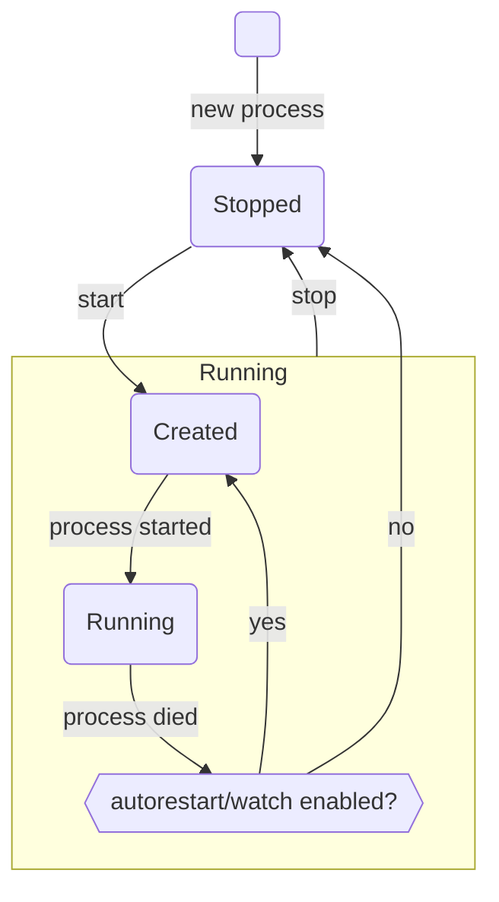

# PM (process manager)
<p align="center"></p>

## Installation
PM is available only for linux due to heavy usage of linux mechanisms. Go to the [releases](https://github.com/rprtr258/pm/releases/latest) page to download the latest binary.

```sh
# download binary
wget https://github.com/rprtr258/pm/releases/latest/download/pm_linux_amd64
# make binary executable
chmod +x pm_linux_amd64
# move binary to $PATH, here just local
mv pm_linux_amd64 pm
```

### Systemd service
To enable running processes on system startup:

```sh
# soft link /usr/bin/pm binary to whenever it is installed
sudo ln -s ~/go/bin/pm /usr/bin/pm
# install systemd service, copy/paste output of following command
pm startup
```

After these commands, processes with `startup: true` config option will be started on system startup.

## Configuration
PM supports multiple configuration formats for defining processes. The original [jsonnet](https://jsonnet.org/) format is supported, along with several additional formats for flexibility:

### Supported Formats
#### JSONNet (.jsonnet)
The primary configuration format. JSONNet is fully compatible with plain JSON.

```jsonnet
[
  {
    name: "web-server",
    command: "node",
    args: ["server.js"],
    env: {
      PORT: "3000",
      NODE_ENV: "production"
    },
    tags: ["web"],
    startup: true
  }
]
```

#### YAML (.yaml, .yml)
[YAML](https://yaml.org/)[ ](https://noyaml.com/)- Human-readable data serialization standard.

```yaml
web-server:
  command: "node"
  args: ["server.js"]
  env:
    PORT: "3000"
    NODE_ENV: "production"
  tags: ["web"]
  startup: true
```

#### TOML (.toml)
[TOML](https://toml.io/) - Tom's Obvious, Minimal Language configuration format.

```toml
[web-server]
command = "node"
args = ["server.js"]
env = { PORT = "3000", NODE_ENV = "production" }
tags = ["web"]
startup = true
```

#### INI (.ini, .cfg, .conf)
Classic configuration file format with section-based structure.

```ini
[web-server]
command = node
args = server.js
env.PORT = 3000
env.NODE_ENV = production
tags = web
startup = true
```

#### HCL (.hcl)
HashiCorp Configuration Language, designed for human-readable machine-friendly configs.

```hcl
process "web-server" {
  command = "node"
  args    = ["server.js"]
  env = {
    PORT     = "3000"
    NODE_ENV = "production"
  }
  tags    = ["web"]
  startup = true
}
```

#### JSON (.json)
Plain JSON configuration format.

```json
[
  {
    "name": "web-server",
    "command": "node",
    "args": ["server.js"],
    "env": {
      "PORT": "3000",
      "NODE_ENV": "production"
    },
    "tags": ["web"],
    "startup": true
  }
]
```

### Configuration Schema
All formats define list of processes with following fields:

| Field | Type | Description | Required |
|-------|------|-------------|----------|
| `name` | `string` | Process name | Yes |
| `command` | `string` | Command to execute | Yes |
| `args` | `array(string)` | Command arguments | No |
| `cwd` | `string` | Working directory | No |
| `env` | `map(string, string)` | Environment variables (name: value pairs) | No |
| `tags` | `array(string)` | Process tags for filtering | No |
| `watch` | `string` | File pattern to watch for restarts (regex) | No |
| `startup` | `boolean` | Start process on system startup | No |
| `depends_on` | `array(string)` | Process names that must start first | No |
| `cron` | `string` | Cron expression for scheduled execution | No |
| `stdout_file` | `string` | File to redirect stdout to | No |
| `stderr_file` | `string` | File to redirect stderr to | No |
| `kill_timeout` | `duration` | Time before SIGKILL after SIGINT | No |
| `autorestart` | `boolean` | Auto-restart on process death | No |
| `max_restarts` | `number` | Maximum restart limit (0 = unlimited) | No |

See [example configuration file](./config.jsonnet). Other examples can be found in [tests](./e2e/tests) directory.

## Usage
Most fresh usage descriptions can be seen using `pm <command> --help`.

### Run process
```sh
# run process using command
pm run go run main.go

# run processes from config file
pm run --config config.jsonnet
```

### List processes
```sh
pm list
```

### Start already added processes
```sh
pm start [ID/NAME/TAG]...
```

### Stop processes
```sh
pm stop [ID/NAME/TAG]...

# e.g. stop all added processes (all processes has tag `all` by default)
pm stop all
```

### Delete processes
When deleting process, they are first stopped, then removed from `pm`.

```sh
pm delete [ID/NAME/TAG]...

# e.g. delete all processes
pm delete all
```

## Process state diagram

```mermaid
flowchart TB
  0( )
  S(Stopped)
  C(Created)
  R(Running)
  A{{autorestart/watch enabled?}}
  0 -->|new process| S
  subgraph Running
    direction TB
    C -->|process started| R
    R -->|process died| A
  end
  A -->|yes| C
  A -->|no| S
  Running -->|stop| S
  S -->|start| C
```

## Development
### Architecture
`pm` consists of two parts:

- **cli client** - requests server, launches/stops shim processes
- **shim** - monitors and restarts processes, handle watches, signals and shutdowns

### PM directory structure
`pm` uses [XDG](https://specifications.freedesktop.org/basedir-spec/latest/) specification, so db and logs are in `~/.local/share/pm` and config is `~/.config/pm.json`. `XDG_DATA_HOME` and `XDG_CONFIG_HOME` environment variables can be used to change this. Layout is following:

```sh
~/.config/pm.json # pm config file
~/.local/share/pm/
├──db/ # database tables
│   └──<ID> # process info
└──logs/ # processes logs
    ├──<ID>.stdout # stdout of process with id ID
    └──<ID>.stderr # stderr of process with id ID
```

### Differences from pm2
- `pm` is just a single binary, not dependent on `nodejs` and bunch of `js` scripts
- [jsonnet](https://jsonnet.org/) configuration language, back compatible with `JSON` and allows to thoroughly configure processes, e.g. separate environments without requiring corresponding mechanism in `pm` (others configuration languages might be added in future such as `Procfile`, `HCL`, etc.)
- supports only `linux` now
- I can fix problems/add features as I need, independent of whether they work or not in `pm2` because I don't know `js`
- fast and convenient (I hope so)
- no specific integrations for `js`

### Release
On `master` branch:

```sh
git tag v1.2.3
git push --tags
GITHUB_TOKEN=<token> goreleaser release --clean
```
